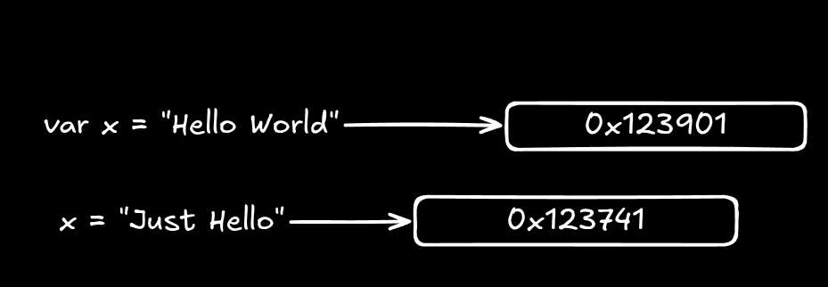

## Imutabilidade

> Sim, strings são imutáveis.

Isso significa que, uma vez criada, o valor de uma string não pode ser alterado.

Qualquer operação que pareça modificar a string (como concatenação com `+`, `ToUpper()`, `Replace()`, etc.) na verdade cria uma nova instância de string no **heap** de memória.

**A string original permanece intocada no local da memória.**

Exemplo: [Localizando endereço de memória](memory_address_location.cs)

## Thread-Safe

Como o valor de uma string nunca muda após sua criação, múltiplas threads podem ler a mesma referência de string ao mesmo tempo sem risco de condições de corrida (race conditions) ou corrupção de dados.

Não há necessidade de usar bloqueios (`lock`) para apenas ler uma string.

Isso torna o **gerenciamento de strings muito seguro** em ambientes multithreaded sem overhead de sincronização manual.

### Quando pode haver problemas com Thread-Safe

**StringBuilder:** O StringBuilder é mutável e não é thread-safe. Se múltiplas threads tentarem alterar o mesmo instance de StringBuilder simultaneamente, você deve usar bloqueios (lock) ou garantir que cada thread tenha sua própria instância.

**Concatenação em Loop:** Em cenários de alta concorrência, a criação constante de novas strings pode gerar pressão no Garbage Collector (GC), mas isso é questão de performance, não de segurança de dados.

## String Interning
O "pool de strings" é um mecanismo de otimização de memória implementado pelo Common Language Runtime (CLR), ao qual funciona diretamente ligado a imutabilidade das strings.
O CLR mantém um repositório especial em memória chamado String Pool (ou intern pool).

Quando você cria uma string literal no código, ex: `string s = "Olá"`, o compilador e o CLR verificam se essa string já existe no pool.
- Se existir: A variável s recebe a mesma referência de memória da string que já está no pool. Nenhuma nova alocação é feita.
- Se não existir: A string é criada, armazenada no pool e a variável aponta para ela.

Isso significa que, em teoria, todas as strings literais idênticas no seu aplicativo apontam para o mesmo endereço de memória.